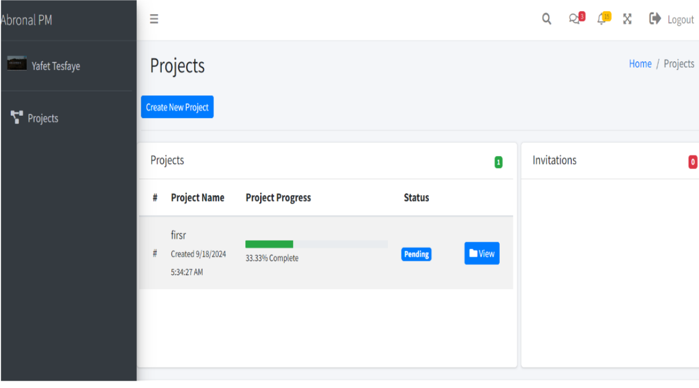
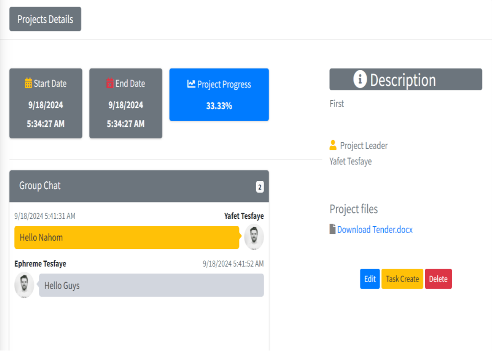
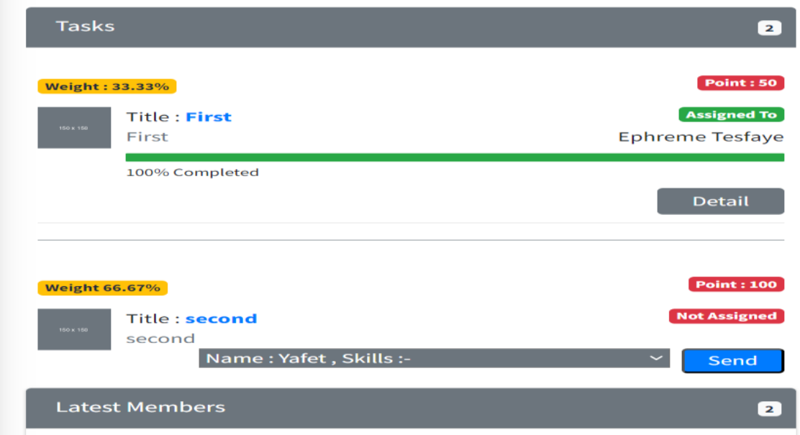

# 📊 TaskTrack

**TaskTrack** is a **web-based project management platform** designed to help teams efficiently **plan, track, and execute projects**.  
Built with **ASP.NET MVC**, TaskTrack provides a **clean and intuitive interface** for managing tasks, milestones, and team collaboration in one place.

---

## 🚀 Features

### 🔐 Role-based Access Control
- Admin, Project Manager, and Team Member roles
- Secure user management and permissions

### 📁 Project Management
- Create, edit, and delete projects
- Assign team members to projects
- Track project progress with milestones

### 📝 Task Management
- Create, assign, and update tasks
- Set deadlines and priorities
- Mark tasks as complete and monitor status

### ⏱️ Milestone & Timeline Tracking
- Visualize project milestones
- Track progress with timelines and completion percentage

### 💬 Team Collaboration
- Comment on tasks and projects
- Real-time updates on task status *(optional with SignalR integration)*

### 📊 Reporting & Analytics
- Generate progress reports
- View team performance and project summaries

---

## 🖼️ Screenshots

| Dashboard | Project Page | Task Details |
|-----------|--------------|--------------|
|  |  |  |


---

## 🧰 Technology Stack

- **Frontend:** ASP.NET MVC, HTML5, CSS3, Bootstrap, JavaScript/jQuery  
- **Backend:** ASP.NET MVC, C#  
- **Database:** SQL Server  
- **Authentication:** ASP.NET Identity  
- **Version Control:** Git

---

## 🛠️ Getting Started

### 1. Clone the Repository
```bash
git clone https://github.com/yaftes/task-track.git
cd task-track
